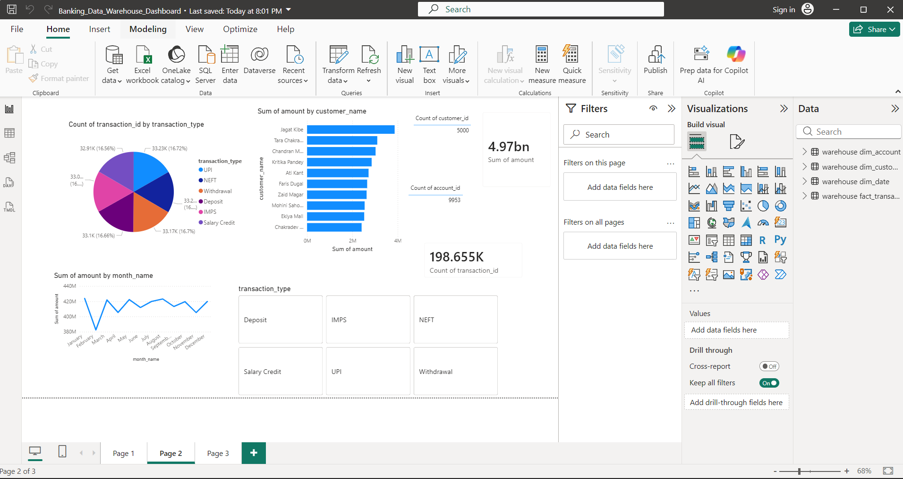

# Banking Data Warehouse Project

## Overview

An end-to-end Data Engineering project that simulates a banking analytics platform using Python, PostgreSQL, Data Warehouse modeling, and Power BI.

The project ingests customer, account, and transaction data, processes it through a multi-layer ETL pipeline, stores it in a dimensional warehouse using Star Schema design, and delivers business insights through an interactive Power BI dashboard.

---

## Business Objective

Banks generate millions of transactions across multiple channels every day.

Business teams require a centralized analytical platform to answer questions such as:

* Which customers generate the highest transaction volume?
* What are the most frequently used transaction channels?
* How do transaction patterns change over time?
* Which account types contribute the most business value?

This project demonstrates how a Data Warehouse can transform raw operational data into actionable business insights.

---

## Solution Architecture

```text
Raw Data Layer
--------------
customers.csv
accounts.csv
transactions.csv

        ↓

Python ETL Layer
----------------
extract.py
transform.py
load.py

        ↓

PostgreSQL Staging Layer
------------------------
staging.customer_test
staging.account_test
staging.transaction_test

        ↓

Warehouse ETL Layer
-------------------
warehouse_loader.py

        ↓

Enterprise Data Warehouse
-------------------------
dim_customer
dim_account
dim_date
fact_transaction

        ↓

Power BI Dashboard
------------------
Business Analytics & Reporting
```

---

## Technology Stack

| Component            | Technology  |
| -------------------- | ----------- |
| Programming Language | Python      |
| Data Processing      | Pandas      |
| Database             | PostgreSQL  |
| Data Warehouse       | Star Schema |
| ETL                  | Python      |
| Reporting            | Power BI    |
| Version Control      | Git         |
| Repository           | GitHub      |

---

## Dataset

Synthetic banking data generated using Python.

### Customer Data

* Customer ID
* Customer Name
* City
* Phone Number
* Annual Income

### Account Data

* Account ID
* Customer ID
* Account Type
* Balance

### Transaction Data

* Transaction ID
* Account ID
* Transaction Type
* Amount
* Transaction Date

---

## ETL Pipeline

### Extract

* Read source CSV files
* Validate input availability
* Load data into Pandas DataFrames

### Transform

* Remove duplicate records
* Handle missing values
* Standardize data types
* Apply business validations

### Load

* Load transformed records into PostgreSQL staging tables
* Perform bulk inserts for optimized performance
* Maintain ETL execution logs

---

## Data Warehouse Design

### Dimension Tables

#### dim_customer

Stores customer attributes.

#### dim_account

Stores account information.

#### dim_date

Stores date hierarchy and calendar attributes.

---

### Fact Table

#### fact_transaction

Stores transactional measures and business metrics.

Measures:

* Transaction Amount

Dimensions:

* Customer
* Account
* Date

---

## Star Schema

```text
                 dim_customer
                       |
                       |
                       |
dim_date ---- fact_transaction ---- dim_account
```

---

## Power BI Dashboard

### Executive KPIs

* Total Customers
* Total Accounts
* Total Transactions
* Total Transaction Amount

### Business Analytics

* Transaction Type Distribution
* Monthly Transaction Trend
* Top Customers by Transaction Volume

### Dashboard Preview



---

## Key Features

* End-to-End Data Pipeline
* Data Warehouse Implementation
* Star Schema Modeling
* Fact & Dimension Tables
* ETL Logging
* Error Handling
* Bulk Loading
* Git Version Control
* Power BI Reporting

---

## Project Structure

```text
Banking-Data-Engineering-Project
│
├── data
│   └── raw
│
├── python
│   └── etl
│
├── power bi
│   └── Banking_Data_Warehouse_Dashboard.pbix
│
├── screenshots
│   └── banking_dashboard.png
│
├── README.md
│
└── .gitignore
```

---

## Future Enhancements

* Docker Containerization
* Apache Airflow Orchestration
* Incremental Data Loading
* Data Quality Framework
* AWS Deployment
* CI/CD Pipeline

---

## Author

Rohit Uniyal

GitHub:
https://github.com/Rohit-Uniyal
