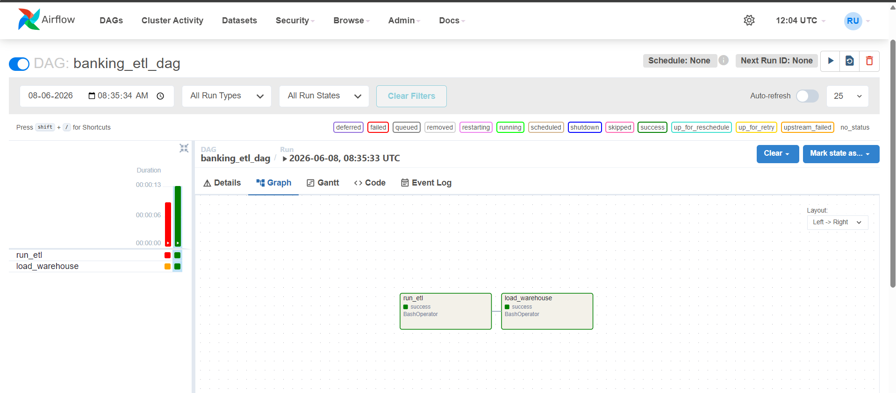

# Banking Data Warehouse & Analytics Platform

## Project Overview

This project demonstrates the design and implementation of an end-to-end Banking Data Warehouse using Python, PostgreSQL, Apache Airflow, Docker, and Power BI.

The solution simulates a real-world banking environment by generating customer, account, and transaction data, loading it into a staging layer, transforming it through ETL pipelines, and building a dimensional data warehouse using Star Schema modeling for analytics and reporting.

## GitHub Repository

https://github.com/Rohit-Uniyal/banking-data-warehouse-project

---

## Business Problem

Banks generate large volumes of transactional data daily. Business users require fast access to analytical insights to support decision-making.

Typical business questions include:

* Which customers maintain the highest balances?
* What is the monthly transaction volume?
* Which account types generate the most activity?
* How do transaction trends change over time?
* Which cities contribute the highest banking revenue?

A Data Warehouse enables efficient reporting, trend analysis, and business intelligence.

---

## Project Architecture

```text
Raw Data Generation
    ↓
customers.csv
accounts.csv
transactions.csv

    ↓

Python ETL Pipeline

    ↓

PostgreSQL Staging Layer

    ↓

Warehouse ETL

    ↓

Star Schema Data Warehouse

    ↓

Power BI Dashboard

    ↑

Apache Airflow Orchestration
```

---

## End-to-End Workflow

```text
Generate Banking Data
        ↓
Raw CSV Files
        ↓
Python ETL Pipeline
        ↓
PostgreSQL Staging Layer
        ↓
Warehouse ETL
        ↓
Star Schema Data Warehouse
        ↓
Power BI Dashboard
        ↑
Apache Airflow DAG
```

---

## Tech Stack

### Data Engineering

* Python
* Pandas
* PostgreSQL
* SQL

### Workflow Orchestration

* Apache Airflow

### Containerization

* Docker
* Docker Compose

### Visualization

* Power BI

### Version Control

* Git
* GitHub

---

## Apache Airflow Orchestration

The ETL process is automated using Apache Airflow.

### DAG Workflow

```text
run_etl
    ↓
load_warehouse
```

Features:

* Workflow orchestration
* Task scheduling
* Dependency management
* Logging and monitoring
* Error handling

---

## Screenshots

### Apache Airflow DAG Execution



### Power BI Banking Dashboard


---

## Data Warehouse Design

### Dimension Tables

* dim_customer
* dim_account
* dim_date

### Fact Table

* fact_transaction

Star Schema:

```text
                 dim_customer
                       |
                       |
                       |
dim_date ---- fact_transaction ---- dim_account
```

---

## Project Features

* End-to-End ETL Pipeline
* PostgreSQL Data Warehouse
* Star Schema Modeling
* Apache Airflow Orchestration
* Docker Containerization
* Power BI Dashboard
* Logging & Monitoring
* Error Handling
* Git Version Control

---

## How To Run

### Generate Data

```bash
python generate_customers.py
python generate_accounts.py
python generate_transactions.py
```

### Run ETL Pipeline

```bash
python python/etl/main.py
```

### Load Data Warehouse

```bash
python python/etl/warehouse_main.py
```

### Start Airflow

```bash
cd airflow
docker compose up -d
```

### Access Airflow

```text
http://localhost:8081
```

---

## Future Enhancements

* AWS Deployment
* Kafka Streaming
* Incremental Loading
* CI/CD Pipeline
* Data Quality Framework

---

## Author

Rohit Uniyal

GitHub:
https://github.com/Rohit-Uniyal

LinkedIn:
https://www.linkedin.com/in/rohituniyal
